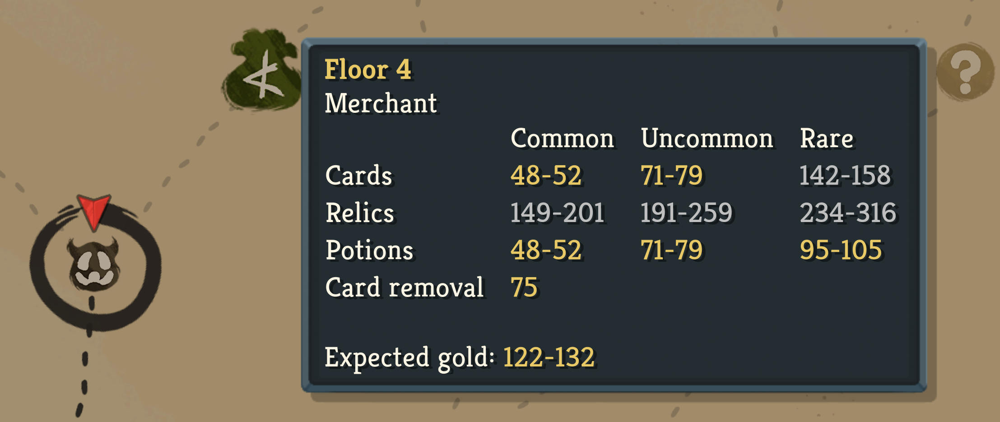
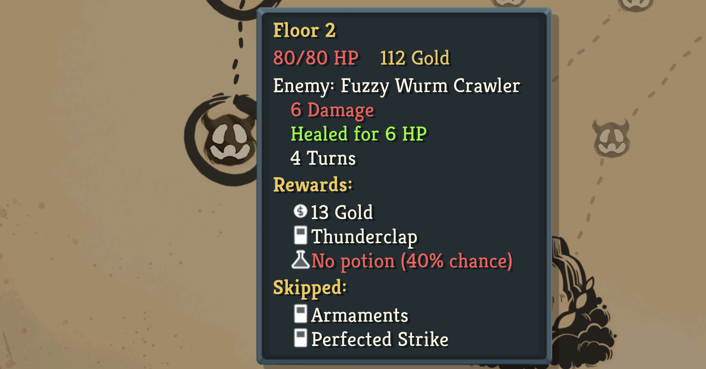
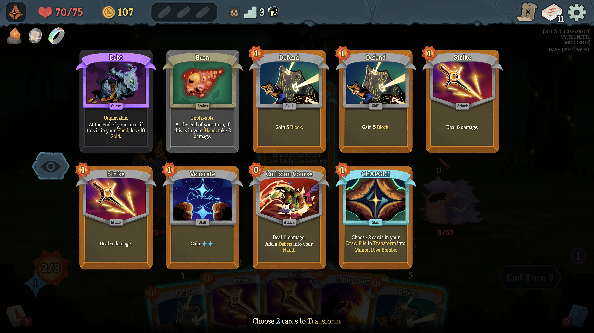

# Colin's Patch Kit

A mod for Slay the Spire 2 with **15 quality-of-life improvements**. These patches are intended to feel like missing vanilla features.

This mod has been tested with the latest beta branch (`v0.107.0`). All patches are purely QOL and do not impact gameplay, nor competitive integrity. They are safe to use in multiplayer.

Please submit feedback / feature requests [via GitHub](https://github.com/colinking/sts2-patch-kit/issues).

## Installation

Download the latest version of `ColinsPatchKit-vX.zip` from the [Releases](https://github.com/colinking/sts2-patch-kit/releases) page. Unzip it and move the `ColinsPatchKit` folder into your mods folder:

| OS | Location |
| --- | --- |
| macOS | `~/Library/Application Support/Steam/steamapps/common/Slay the Spire 2/SlayTheSpire2.app/Contents/MacOS/mods/ColinsPatchKit` |
| Windows | `C:\Program Files (x86)\Steam\steamapps\common\Slay the Spire 2\mods\ColinsPatchKit` |
| Linux | `~/.local/share/Steam/steamapps/common/Slay the Spire 2/mods/ColinsPatchKit` |

## Patches

All patches are **enabled by default** and can be toggled
individually (Main Menu > Mod Configuration > ColinsPatchKit).

### Map

#### Current floor tooltip

If enabled, hovering over the current floor on the map will show a tooltip indicating the game state. The vanilla game
only shows this tooltip for previously visited floors.

#### Upcoming floor tooltips

If enabled, hovering over an upcoming floor on the map shows an informative tooltip. It only ever shows wiki-level information a diligent player could already work out —
never the actual pre-rolled outcome of that specific floor:

- **Unknown (`?`)** — the chance it resolves into a Monster / Treasure / Shop / Event. Hold
  Cmd (macOS) / Ctrl (Windows) while hovering to list the events that could spawn.
- **Merchant** — the price ranges for cards, relics and potions, the next card-removal cost, and an indication of which you are expected to be able to afford.
- **Treasure** — the expected rewards.
- **Rest Site** — the possible options, including the max you could heal.
- **Enemy** — the expected rewards. Hold Cmd / Ctrl to list the enemies that
  could spawn. The act's opening combats draw from an
  easy pool and later ones from a hard pool, so the list narrows to just the easy or hard pool
  when every route to the floor guarantees it.
- **Elite** — the expected rewards. Hold Cmd / Ctrl to list the elites that could spawn.
- **Boss** — the expected rewards.

#### Potion chances

If enabled, combat map tooltips show the chance of receiving a potion (on previous, current, and upcoming tooltips).

### Combat

#### Well Laid Plans retain slots

If enabled, choosing cards to Retain with Well Laid Plans shows one dotted card outline ("slot") per card you can retain.

#### Curses & statuses first when exhausting

If enabled, curses and statuses will be rendered first when choosing a card from your draw pile to exhaust (Cleanse) or transform into a specific
card (Charge, Séance).

In vanilla, these are sorted to the bottom even though they are usually the cards you want to get rid of. Order is otherwise not affected. This mirrors the vanilla behavior when removing cards.

#### More active relic pulses

Vanilla relics with a limited effect (e.g. Vambrace) pulse their inventory icon while the effect is available and stop once used.
If enabled, this patch enables pulsing for a handful of additional relics that benefit from this behavior:

- **Permafrost** — once per combat, your first Power card grants Block.
- **Centennial Puzzle** — once per combat, the first time you take unblocked damage you draw cards.
- **Ruined Helmet** — once per combat, your first Strength gain is doubled.
- **Lava Lamp** — pulses while you still qualify for upgraded card rewards (no unblocked damage taken).
- **Demon Tongue** — once per turn, the first unblocked damage taken during your turn heals you.
- **Mini Regent** — once per turn, the first time you spend stars you gain Strength.
- **Music Box** — once per turn, your first Attack is duplicated.

*Centennial Puzzle pulsing while its effect is still available.*

#### Active buff/debuff pulses

If enabled, buff/debuff icons will also pulse if they have a limited-time effect that is still available:

- **First-each-turn effects** pulse while still available this turn: Echo Form, Iteration, Nostalgia, Phantom Blades, Lethality, Unmovable, Pale Blue Dot
  (5+ cards played — bonus draw locked in), and Smoggy (warning: your first Skill will trigger it).
- **Counters** pulse when one step from triggering: Juggling (2 of 3 attacks played), Orbit,
  Automation, Panache, Outbreak, and the Aeonglass's Withering Presence (your next card play adds a Wither).
- **Countdowns** pulse when the event fires after this turn: The Bomb, Asleep, Slumber,
  Hatch, and the Battleworn Dummy time limit.
- **End-of-turn damage debuffs** pulse the whole time as a "don't forget to block" reminder:
  Constrict and Disintegration.

*Juggling pulsing after the second Attack this turn — the next Attack triggers it.*

### Menus

#### Random character bans

If enabled, you can ban characters when selecting a random character. For example, you may want to play a random character other than who you just played as.

First select "Random", then right-click a character to ban it (right-click again to unban); embarking then chooses only from the characters you haven't banned.

In multiplayer, only your own random pick is affected. Due to how random character selection is implemented in multiplayer, readying up with at least one ban will immediately resolve the random character.

#### View Upgrades toggle

If enabled, the card reward screen gets the same "View Upgrades" toggle as the deck view. Also works with Scroll Boxes.

#### Multiplayer cards Compendium toggle

If enabled, the "Multiplayer cards" toggle in the Compendium defaults to match your current run: in singleplayer it defaults off, in multiplayer it defaults on.

### Speed-ups

#### Skip game over animations

The game over screen that renders your score slowly shows one line at a time. If enabled, this patch allows you to click on the screen to skip this animation and full resolve the score UI. This is useful if you just want to get back to the main menu faster to start a new run.

#### Move shop hand away faster

If enabled, the merchant's pointing hand returns to its resting position faster after you
stop hovering over a shop item. This helps prevent the merchant's hand from blocking your view of the shop.

#### Skip special card reward delay

If enabled, taking a "special card" reward (Thieving Hopper, Lantern Key) will send it straight to your deck instead of floating
in the center of the screen for two seconds. This avoids blocking your view and mirrors how normal card rewards work.

#### Skip intro logo

If enabled, the Mega Crit logo animation at startup is skipped and the game boots straight to the
main menu.

### Experimental

Experimental patches are **disabled** by default, but can be enabled via the mod configuration UI.

#### Translucent Ethereal card frames

If enabled, the colored frame of Ethereal cards is rendered slightly transparent so they are easier
to spot at a glance. Card text, art and icons stay fully opaque. (Quest and Ancient cards are
excluded; their frames use a different texture layout.)

This patch is experimental as it's unclear what the best way is to
indicate Ethereal (and eventually Retain, Sly, and Exhaust) keywords without conflicting with
enchantments and afflictions. The problem this patch is trying to solve is that keywords are not visible on cards in your hand unless you hover over the card. This is specifically problematic when adding a keyword temporarily to a card (e.g. Sculpting Strike, or powers/relics that add ethereal cards to your hand).
