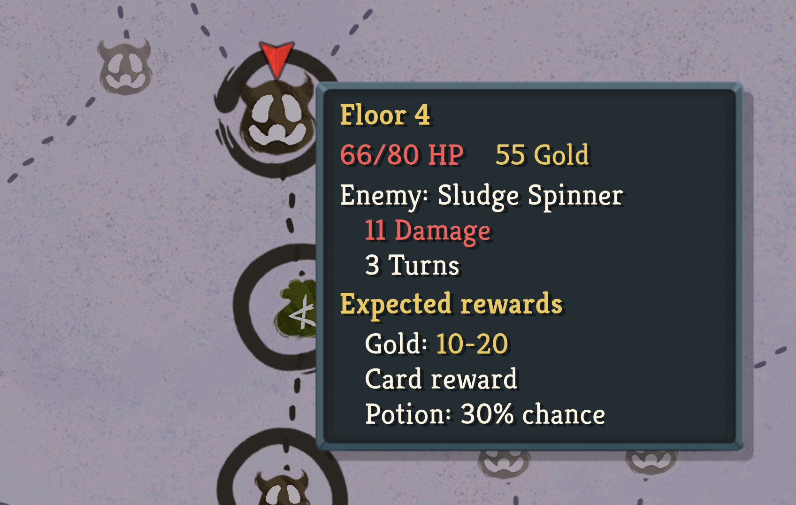
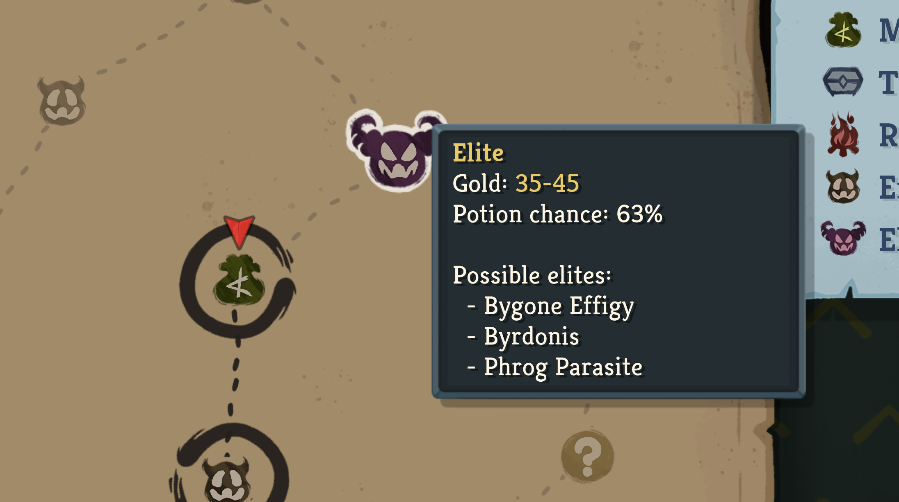
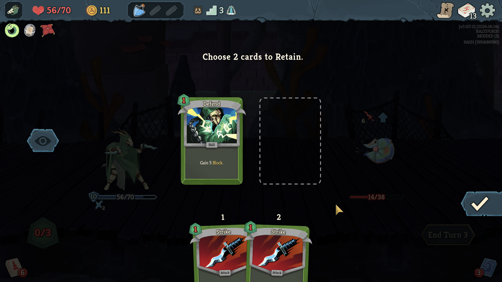
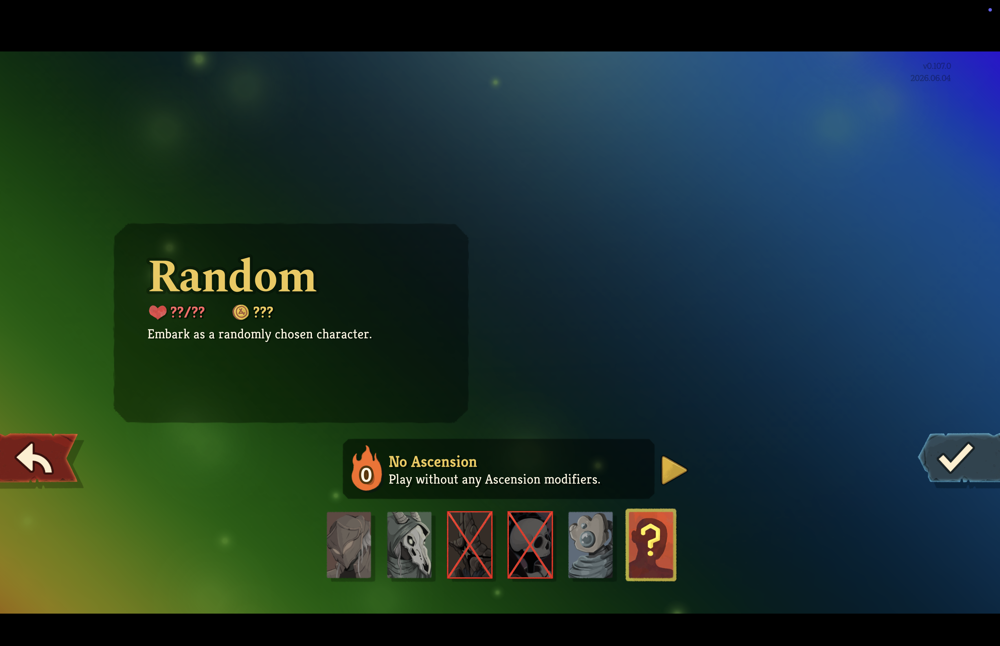
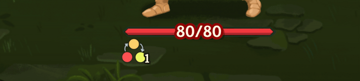
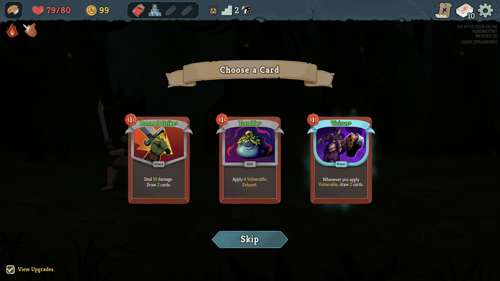

# Colin's Patch Kit

A Slay the Spire 2 mod with various quality-of-life patches.

This mod has been tested with the latest beta branch (`v0.107.0`).

## Patches

All patches are enabled by default (except where marked experimental) and can be toggled
individually via the BaseLib mod configuration UI.

All patches are purely QOL and do not impact gameplay. They are safe to use in multiplayer.

### Map: Show Current Room Tooltip

If enabled, hovering over the current map node will show a tooltip indicating the game state. The vanilla game
only shows this tooltip for previously visited nodes.

### Map: Show Upcoming Room Info

If enabled, hovering over an upcoming (not-yet-visited) map node shows a tooltip summarising what that
room type is worth. It only ever shows wiki-level information a diligent player could already work out —
never the actual pre-rolled outcome of that specific node:

- **Unknown (`?`)** — the live chance it resolves into a Monster / Treasure / Shop / Event. Hold
  Cmd (macOS) / Ctrl (Windows) while hovering to list the events that could still spawn this run
  (events you've already had are excluded).
- **Elite** — the gold range and your potion chance. Hold Cmd / Ctrl to list the elites this act
  can still spawn (already-fought elites are excluded).
- **Enemy** — the gold range and your potion chance. Hold Cmd / Ctrl to list the enemies that
  could still spawn here (already-fought ones excluded). The act's opening combats draw from an
  easy pool and later ones from a hard pool, so the list narrows to just the easy or hard pool
  when every route to the node guarantees it, and shows both (labelled) while it's still uncertain.
- **Treasure** — the relic pick and gold range (including any Spoils Map bonus, or "empty" when a
  relic like Silver Crucible suppresses the reward).
- **Merchant** — the price ranges for cards, relics and potions, plus the next card-removal cost.
- **Rest Site** — how much HP you would heal.

Potion chance is also shown on the current node while you're mid-combat (before the reward
screen). Generally, potion chances are marked with a `*` when it will still shift as you
clear combats on the way there.

### Combat: Well Laid Plans Retain Slots

If enabled, choosing cards to Retain with Well Laid Plans shows one dotted card outline ("slot")
per retain charge above your hand. Picking a card fills the leftmost empty slot, and clicking a
selected card returns it to your hand and leaves its slot empty in place — so you can always see
how many cards you can still retain.

### Character Select: Random Character Bans

If enabled, you can ban characters from the "Random" pick. With Random selected on the character
select screen, right-click a character to ban it (right-click again to unban); embarking as Random
then chooses only from the characters you haven't banned. In multiplayer, only your own Random pick
is affected.

### Combat: Curses & Statuses First When Exhausting

If enabled, choosing a card from your draw pile to exhaust (Cleanse) or transform into a specific
card (Charge, Séance) lists curses first, then statuses, then the rest of the pile — instead of
sorting them to the very bottom as the game does by default. These are almost always the cards you
opened the screen to get rid of, so this puts them where you look first. Cards within each group
keep their usual rarity-then-alphabetical order. Other draw-pile choices that pull a card to play
(such as Wish), and the deck view, are unaffected.

### Relics: Ready-Effect Pulses

Vanilla relics with a limited effect (e.g. Vambrace) pulse their inventory icon while the effect
is still available and stop once it is used. Seven relics with the same kind of once-per-turn or
once-per-combat effect don't, so you can't tell whether the effect is still pending. If enabled,
these relics pulse the same way:

- **Permafrost** — once per combat, your first Power card grants Block.
- **Centennial Puzzle** — once per combat, the first time you take unblocked damage you draw cards.
- **Ruined Helmet** — once per combat, your first Strength gain is doubled.
- **Lava Lamp** — pulses while you still qualify for upgraded card rewards (no unblocked damage taken).
- **Demon Tongue** — once per turn, the first unblocked damage taken during your turn heals you.
- **Mini Regent** — once per turn, the first time you spend stars you gain Strength.
- **Music Box** — once per turn, your first Attack is duplicated.

*Centennial Puzzle pulsing while its effect is still available; Burning Blood (no limited
effect) stays static.*

### Powers: Ready-Effect Pulses

Power icons can pulse too, but vanilla only uses it for Escape Artist (pulses when the enemy
escapes after the next turn). If enabled, the same pulse is applied consistently:

- **First-each-turn effects** pulse while still available this turn: Echo Form (next card
  duplicated), Iteration, Nostalgia, Phantom Blades, Lethality, Unmovable, Pale Blue Dot
  (5+ cards played — bonus draw locked in), and Smoggy (warning: your first Skill will
  trigger it).
- **Counters** pulse when one step from triggering: Juggling (2 of 3 attacks played), Orbit,
  Automation, Panache, Outbreak, and the Aeonglass's Withering Presence (your next card play
  adds a Wither).
- **Countdowns** pulse when the event fires after this turn: The Bomb, Asleep, Slumber,
  Hatch, and the Battleworn Dummy time limit.
- **End-of-turn damage debuffs** pulse the whole time as a "don't forget to block" reminder:
  Constrict and Disintegration.

*Juggling pulsing after the second Attack this turn — the next Attack triggers it.*

### Startup: Skip Intro Logo

If enabled, the Mega Crit logo animation at startup is skipped and the game boots straight to the
main menu.

### Game Over: Click to Skip Reveal

If enabled, clicking (or pressing confirm) on the run-summary screen shown when a run ends
fast-forwards the score-line and badge reveal animations. Each click snaps the current line into
place and collapses the remaining pauses between sections, so a few clicks reach the Return to Main
Menu button immediately. Doing nothing keeps the vanilla pacing.

### Compendium: Multiplayer Cards Toggle Matches Run

If enabled, opening the Compendium's card library during a run defaults the "Multiplayer cards"
toggle to whether the run is multiplayer — singleplayer runs hide multiplayer-only cards, and
multiplayer runs show them. The vanilla game always defaults the toggle to on. Outside a run
(the main menu Compendium) the vanilla default is kept, and the toggle can still be flipped
manually at any time.

### Shop: Move Hand Away Faster

If enabled, the merchant's pointing hand returns to its resting position 0.3 seconds after you
stop hovering over a shop item, instead of lingering over the wares for two seconds and blocking
your view of the goods. The brief delay keeps the hand from twitching back while you move between
adjacent items. The pointing gesture after a purchase is unchanged.

### Card Rewards: View Upgrades Toggle

If enabled, the card reward screen gets the same "View Upgrades" toggle as the deck view, in the
same bottom-left spot. Ticking it shows each reward card in its upgraded form (cards that cannot be
upgraded are unaffected); picking a card still grants the regular, unupgraded version. Like the
deck view's toggle, it is mouse-only and hidden while playing with a controller.

The toggle also appears on the choose-a-pack screen used by the Scroll Boxes relic, where it
previews the cards of both bundles — stacked or spread out — and clears while a chosen bundle
flies into the deck.

### Card Rewards: Skip Returned Card Preview Delay

If enabled, taking a "special card" reward — the card the Thieving Hopper stole and hands back when
it dies, or the card from the Lantern Key event — sends it straight to your deck instead of floating
it in the center of the screen for two seconds first. The centered hold otherwise blocks your view
of whatever is behind it, such as the middle card on the card reward screen. Normal card rewards
already behave this way; this just makes special card rewards match.

### Cards: Translucent Ethereal Card Frames (Experimental: disabled by default)

If enabled, the colored frame of Ethereal cards is rendered slightly transparent so they are easy
to spot at a glance. Card text, art and icons stay fully opaque. (Quest and Ancient cards are
excluded; their frames use a different texture layout.)

This UI is experimental and therefore disabled by default. It's unclear what the best way is to
indicate Ethereal (and eventually Retain, Sly, and Exhaust) keywords without conflicting with
enchantments and afflictions.

## Installation instructions

You will need to download the `.dll`, `.pck`, and `.json` files from
[Releases](https://github.com/colinking/sts2-patch-kit/releases) and put them in your `Slay the Spire 2/mods` folder.

## Development

### Building

You can build this mod by running `dotnet build ColinsPatchKit.csproj`.

### Publishing

You can publish this mod by running `dotnet publish ColinsPatchKit.csproj`. This should be done after every edit.

### Decompiled source code

The decompiled source code is accessible in: `../../elliotttate/sts2-modding-mcp/decompiled`. This is based on
https://github.com/elliotttate/sts2-modding-mcp.
